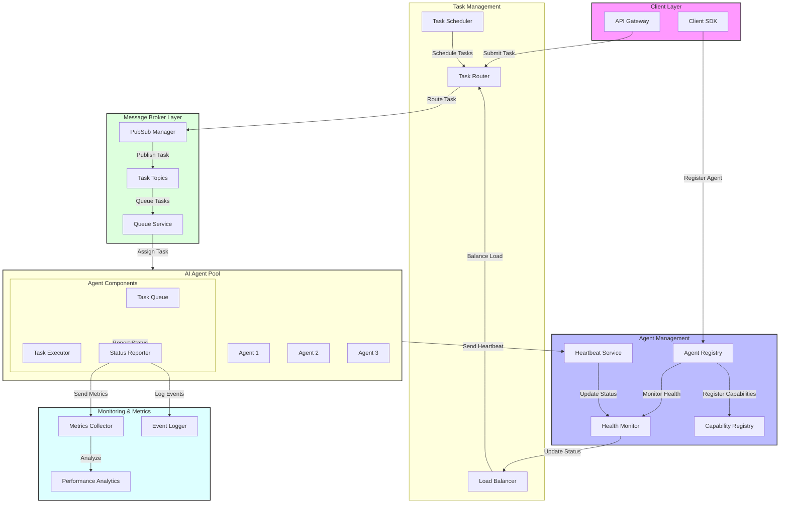

# AI Task Routing System Architecture

## System Overview
The AI Task Routing System is a distributed platform designed to efficiently manage and route tasks to AI agents based on their capabilities, current load, and health status. The system is built with scalability, reliability, and monitoring as core principles.

## Architecture Layers

### 1. Client Layer
#### Components:
- **API Gateway**: Entry point for task submissions and agent registrations
- **Client SDK**: Libraries for easy integration with the system

#### Responsibilities:
- Request validation and authentication
- Rate limiting and throttling
- Initial request routing
- Client-side load balancing

### 2. Agent Management Layer
#### Components:
- **Agent Registry**: Central repository of all registered AI agents
- **Heartbeat Service**: Monitors agent availability and health
- **Health Monitor**: Tracks agent performance and status
- **Capability Registry**: Manages agent capabilities and matching

#### Responsibilities:
- Agent registration and deregistration
- Capability management and validation
- Health status monitoring
- Agent lifecycle management

### 3. Message Broker Layer
#### Components:
- **Task Topics**: Topic-based message channels
- **Queue Service**: Persistent task queues
- **PubSub Manager**: Message distribution system

#### Responsibilities:
- Reliable message delivery
- Task distribution
- Queue management
- Message routing

### 4. Task Management Layer
#### Components:
- **Task Router**: Routes tasks to appropriate agents
- **Task Scheduler**: Manages task timing and priorities
- **Load Balancer**: Distributes tasks across agents

#### Responsibilities:
- Task routing logic
- Load distribution
- Priority management
- Task scheduling

### 5. AI Agent Pool Layer
#### Components:
- **Individual Agents**: AI service providers
- **Task Queue**: Per-agent task queues
- **Task Executor**: Task processing engine
- **Status Reporter**: Agent status reporting

#### Responsibilities:
- Task execution
- Status reporting
- Resource management
- Error handling

### 6. Monitoring Layer
#### Components:
- **Metrics Collector**: Gathers system metrics
- **Event Logger**: Logs system events
- **Performance Analytics**: Analyzes system performance

#### Responsibilities:
- System monitoring
- Performance tracking
- Error logging
- Analytics

## System Workflows

### 1. Agent Registration Flow

### 2. Task Routing Flow

### 3. Task Execution Flow

## Fault Tolerance and Recovery

### 1. Agent Failure Handling
- Heartbeat monitoring detects failures
- Tasks automatically rerouted
- Agent state preserved for recovery

### 2. Message Delivery Guarantees
- At-least-once delivery
- Message persistence
- Dead letter queues

### 3. System Recovery
- Automatic agent recovery
- Task reprocessing
- State reconciliation

## Scaling Considerations

### 1. Horizontal Scaling
- Agent pool can grow dynamically
- Message broker clusters
- Distributed task routing

### 2. Performance Optimization
- Load-based routing
- Priority queuing
- Resource pooling

### 3. Resource Management
- Agent resource limits
- Queue depth monitoring
- Backpressure mechanisms

## Security and Monitoring

### 1. Security Features
- Agent authentication
- Message encryption
- Access control

### 2. Monitoring Features
- Real-time metrics
- Performance tracking
- Error monitoring
- Health checks
